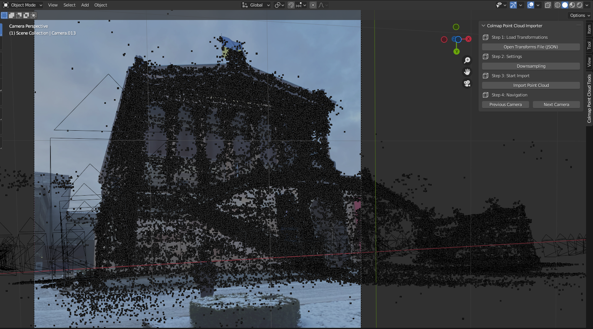
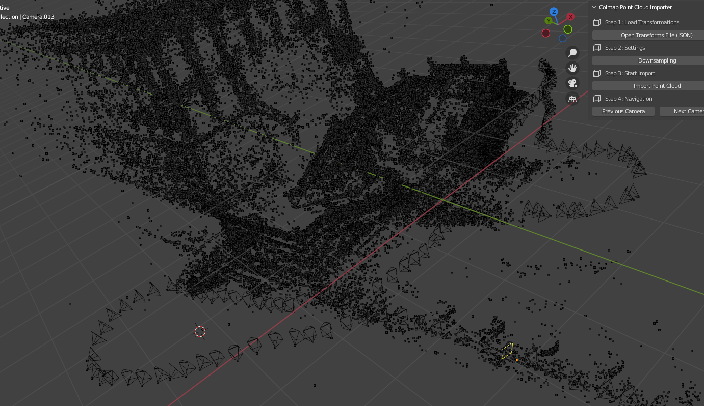

# GUIDE

## SETUP

### Setup Conda

`conda env create -f environment.yml`

`conda activate historical-photo-sfm-pipeline`

`sudo apt update`

### Install Colmap

Pre install:

- `git submodule update --init --recursive`
- `cd third_party/colmap`
- `git checkout tags/3.9.1`

This project uses pycolmap which is a python wrapper for colmap, but it does not support dense MVS reconstruction due to lacking CUDA support, so lets just use the official colmap build.

See file `INSTALL_COLMAP.md` for more info

### Install FFMPEG

if you want to convert your video into single frames you need to download ffmpeg

`sudo apt install ffmpeg`

## RUN

Start Jupyter Lab

`jupyter lab`

Go to `main.ipynb` and go through the cells step by step

## View Results

You have two options to view your generted point cloud.
Both methods require a json with the estimated poses/frames from the corse reconstruction which can be generated in the main notebook.

### With Blender (preferred!)

I wrote a custom script which can load the transforms json with frames and points and visualize it in Blender. Either open blender and load the script under `scripts/colmap_pc_importer_ui.py` or run the following command:

`blender --python scripts/colmap_pc_importer_ui.py`

Then clear all scene objects and open the right 3D Object Mode Panels (for my by pressing `n` on the keyboard). There you will see the `Colmap Point Cloud Tools` panel:

### With a Jupyter Notebook

The Neuralangelo project offers a notebook which can display the point cloud.

Go to `scripts/third_party/neuralangelo/visualize_colmap.ipynb` and adjust if needed, then run.

## Third Party Tools and Libraries

- [Neuralangelo](https://github.com/NVlabs/neuralangelo)
- [Colmap](https://github.com/colmap/colmap)
